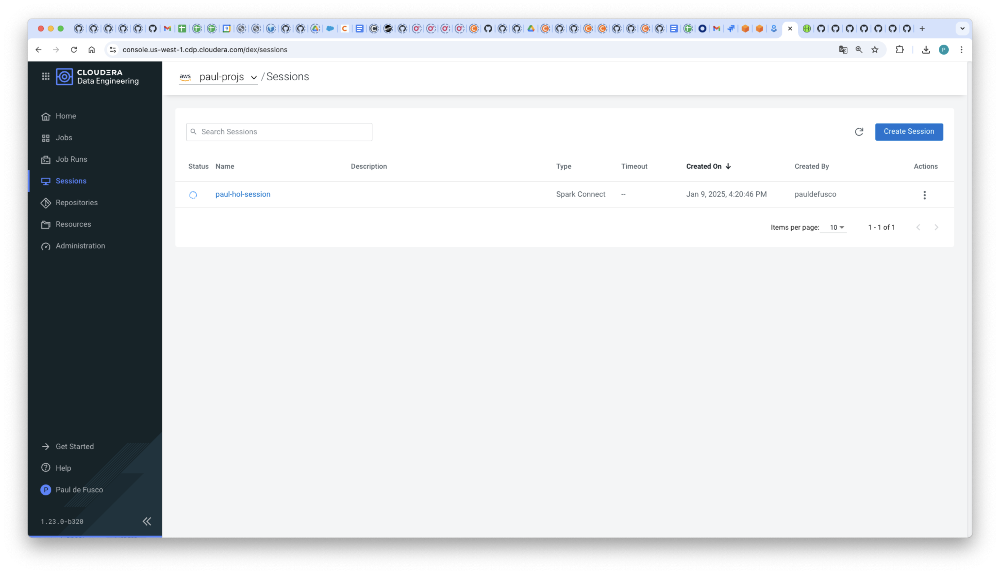
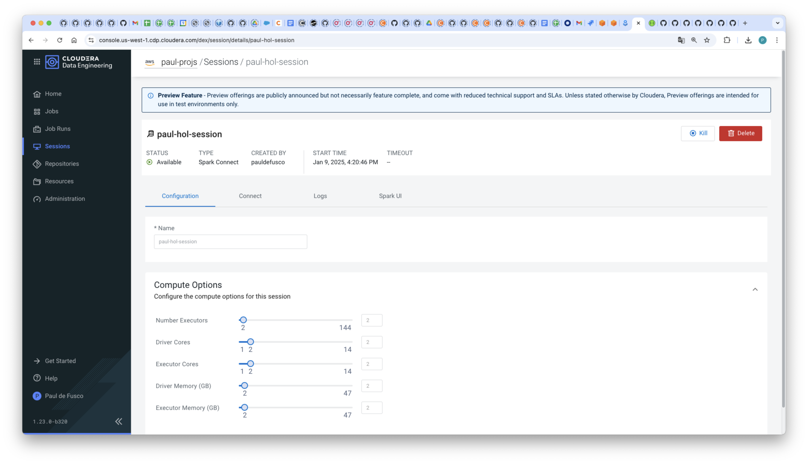
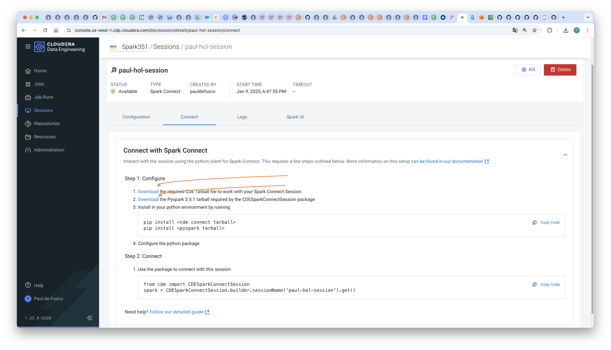
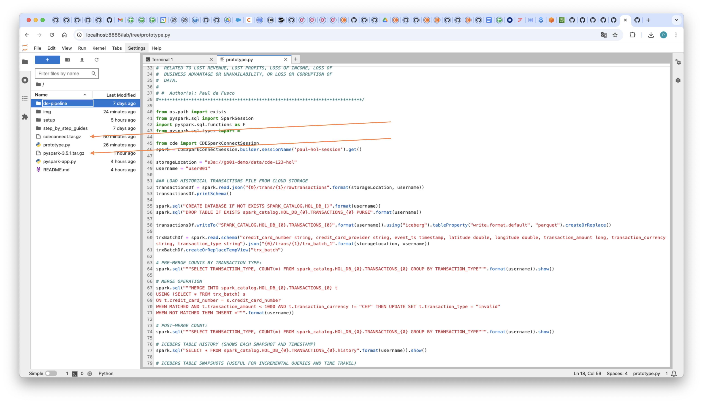
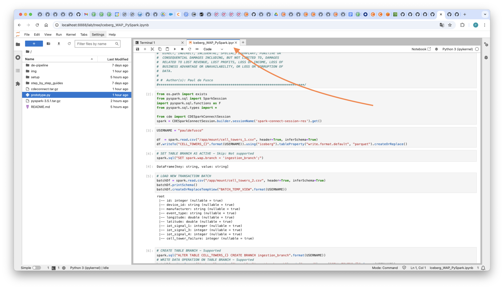
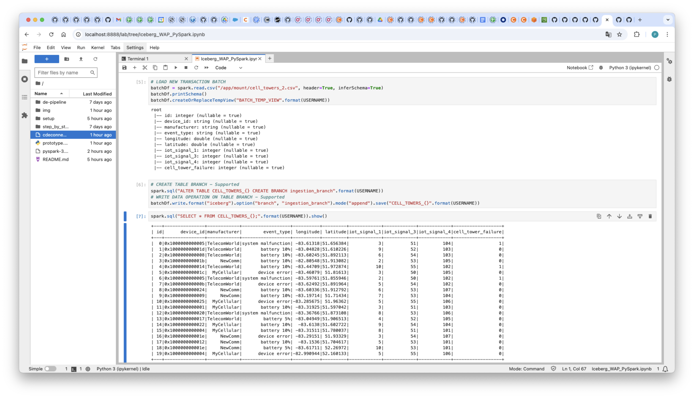

# Instructions

## Prerequisites

* A CDE Service and Virtual Cluster on version 1.23 or above.
* A local installation of the CDE CLI on version 1.23 or above.
* A local installation of JupyterLab. Version 4.0.7 was used for this demonstration but other versions should work as well.
* A local installation of Python. Version 3.9.12 was used for this demonstration but other versions will work as well.

### 1. Launch a CDE Spark Connect Session

Create CDE Files Resources and upload csv files.

```
cde resource create \
  --name telcoFiles \
  --type files
```

```
cde resource upload \
  --name telcoFiles \
  --local-path resources/cell_towers_1.csv \
  --local-path resources/cell_towers_2.csv
```

Start a CDE Session of type Spark Connect. Edit the Session Name parameter so it doesn't collide with other users' sessions.

```
cde session create \
  --name spark-connect-session-res \
  --type spark-connect \
  --num-executors 2 \
  --driver-cores 2 \
  --driver-memory "2g" \
  --executor-cores 2 \
  --executor-memory "2g" \
  --mount-1-resource telcoFiles
```

In the Sessions UI, validate the Session is Running.





### 2. Install Spark Connect Prerequisites

From the terminal, install the following Spark Connect prerequisites:

* Download the cdeconnect and PySpark packages from the CDE Session Configuration tab and place them in your project home folder:





* Create a new Python Virtual Environment:

```
python -m venv spark_connect_jupyter
source spark_connect_jupyter/bin/activate
```

* Install the following packages:

```
pip install numpy==1.26.4
pip install --upgrade cmake
pip install pyarrow==14.0.0
pip install cdeconnect.tar.gz  
pip install pyspark-3.5.1.tar.gz
```

* Launch the JupyterLab server with:

```
jupyter lab
```




### 3. Run Your First PySpark & Iceberg Application via Spark Connect

You are now ready to connect to the CDE Session from your local JupyterLab instance using Spark Connect.

* In the first cell, edit the sessionName option and add your session name from the CLI Create Session command above.
* In the second cell, edit your username.

Now run each cell and observe outputs.



### 4. PySpark & Iceberg Application code walkthrough

Coming soon.
