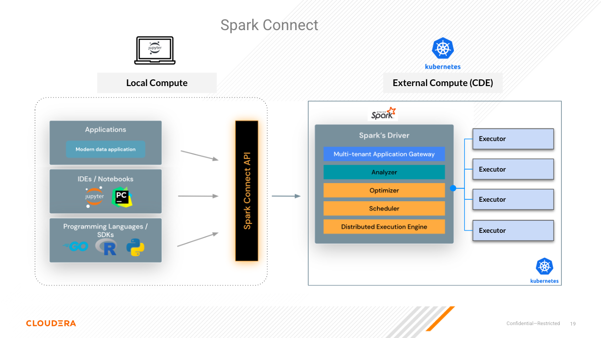
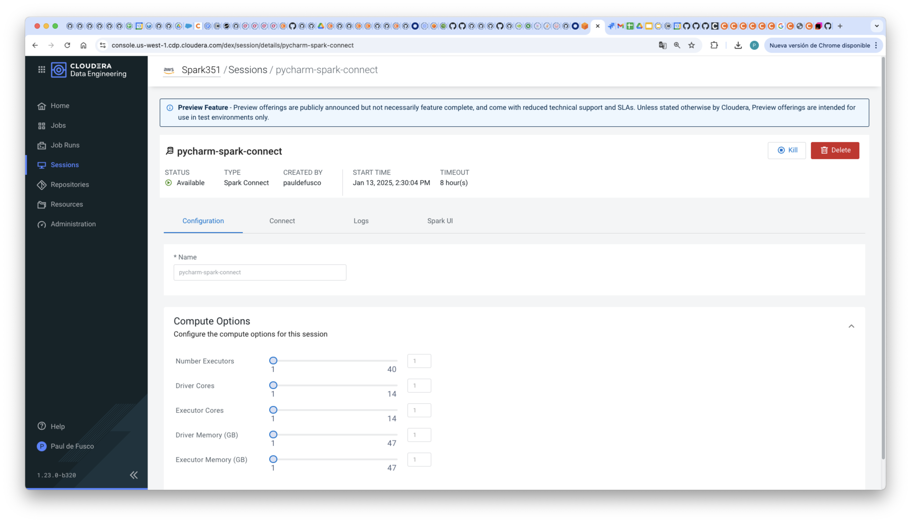
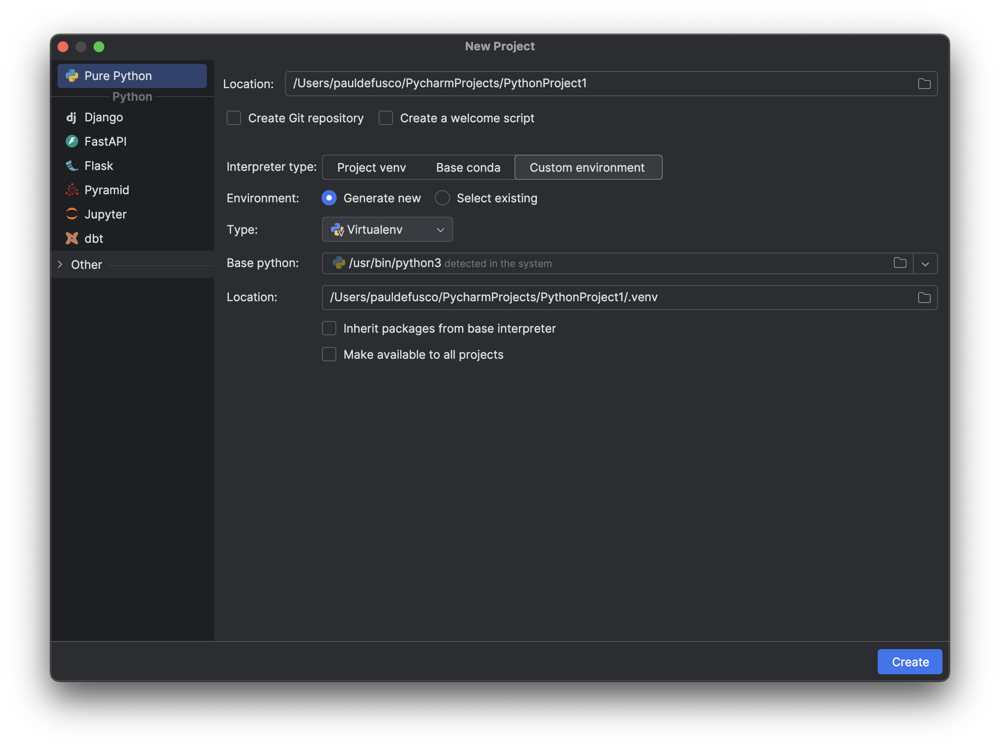
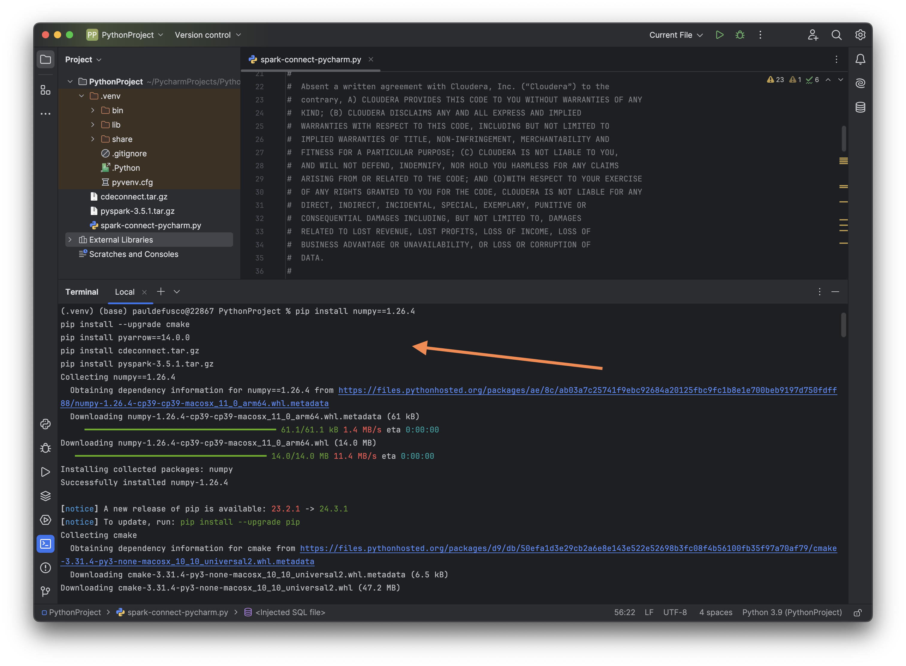
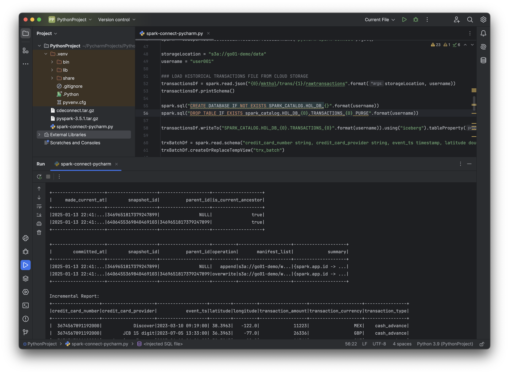

# PyCharm and Spark Connect Quickstart in CDE



## Prerequisites

* A CDE Service and Virtual Cluster on version 1.23 or above, and 3.5.1, respectively.
* A local installation of the CDE CLI on version 1.23 or above.
* A local installation of JupyterLab. Version 4.0.7 was used for this demonstration but other versions should work as well.
* A local installation of Python. Version 3.9.12 was used for this demonstration but other versions will work as well.

### 1. Launch a CDE Spark Connect Session

Start a CDE Session of type Spark Connect. Edit the Session Name parameter so it doesn't collide with other users' sessions.

```
cde session create \
  --name pycharm-session \
  --type spark-connect \
  --num-executors 2 \
  --driver-cores 2 \
  --driver-memory "2g" \
  --executor-cores 2 \
  --executor-memory "2g"
```

In the Sessions UI, validate the Session is Running.



### 2. Install Spark Connect Prerequisites

From the terminal, install the following Spark Connect prerequisites:

* Create a new Project and Python Virtual Environment in PyCharm:



* In the terminal, install the following packages. Notice that these exact versions were used with Python 3.9. Numpy, cmake, and PyArrow versions may be subject to change depending on your Python version.

```
pip install numpy==1.26.4
pip install --upgrade cmake
pip install pyarrow==14.0.0
pip install cdeconnect.tar.gz  
pip install pyspark-3.5.1.tar.gz
```



### 3. Run Your First PySpark & Iceberg Application via Spark Connect

You are now ready to connect to the CDE Session from your local IDE using Spark Connect.

Open "prototype.py". Make the following changes:

* At line 46, edit the "sessionName" parameter with your Session Name from the above CLI command.
* At line 48, edit the "storageLocation" parameter with the following: <Enter Cloud Storage Location Here>
* At line 49, edit the "username" parameter with your assigned username.

Now run "prototype.py" and observe outputs.


