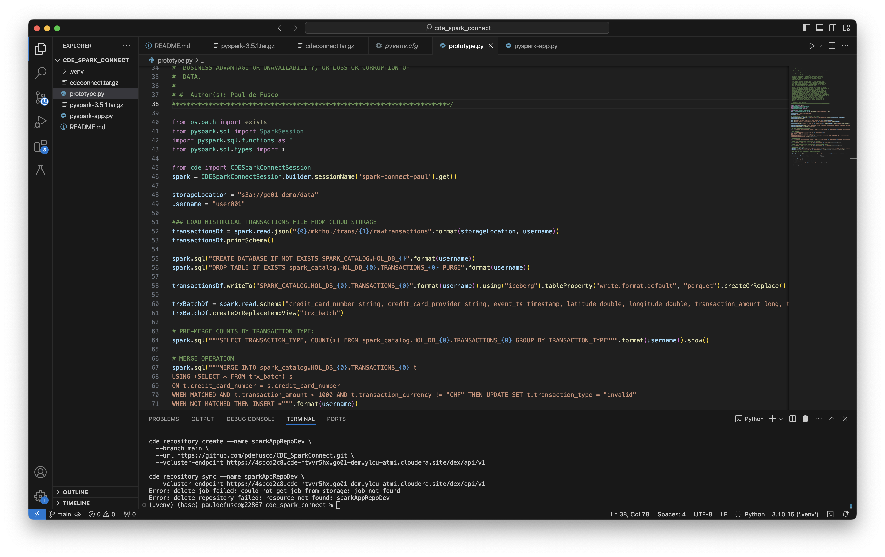

# Instructions

## 0. PySpark & Iceberg Application code walkthrough


## 1. Test jobs in CDE Session from local

#### Launch a CDE Spark Connect Session

Start a CDE Session of type Spark Connect. Edit the Session Name parameter so it doesn't collide with other users' sessions.

```
cde session create \
  --name paul-hol-session \
  --type spark-connect \
  --num-executors 2 \
  --driver-cores 2 \
  --driver-memory "2g" \
  --executor-cores 2 \
  --executor-memory "2g"
```

In the Sessions UI, validate the Session is Running.


#### Install Spark Connect Prerequisites

From the terminal, install the following Spark Connect prerequisites:

* Create a new Python Virtual Environment:

```
python -m venv spark_connect_vscode
source spark_connect_vscode/bin/activate
```

* Install the following packages:

```
pip install numpy==1.26.4
pip install --upgrade cmake
pip install pyarrow==14.0.0
pip install cdeconnect.tar.gz  
pip install pyspark-3.5.1.tar.gz
```

* Open VS Code.


#### Run Your First PySpark & Iceberg Application via Spark Connect

You are now ready to connect to the CDE Session from your local IDE using Spark Connect.

Open "prototype.py" in your IDE (VSCode or JupyterLab). Make the following changes:

* At line 46, edit the "sessionName" parameter with your Session Name from the above CLI command.
* At line 48, edit the "storageLocation" parameter with the following: <Enter Cloud Storage Location Here>
* At line 49, edit the "username" parameter with your assigned username.

Now run "prototype.py" and observe outputs.


